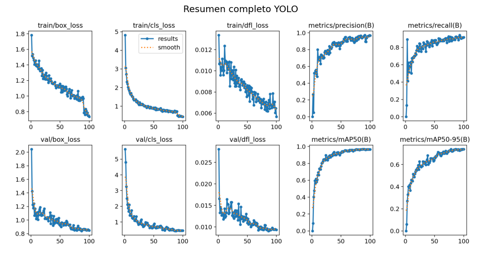
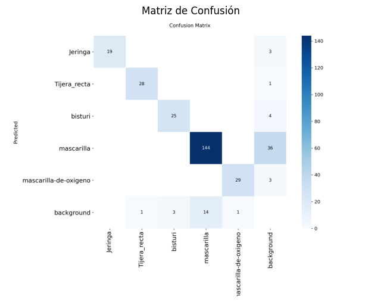
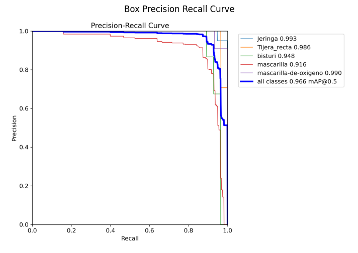
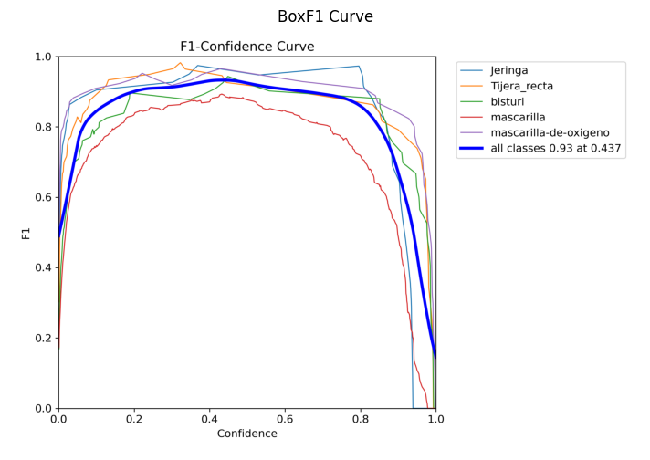
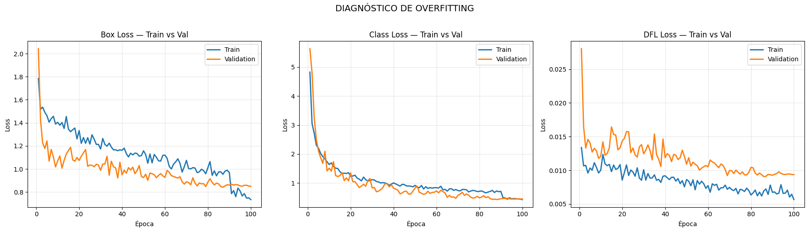
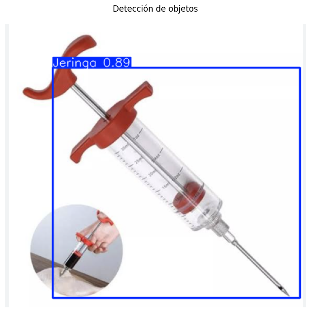
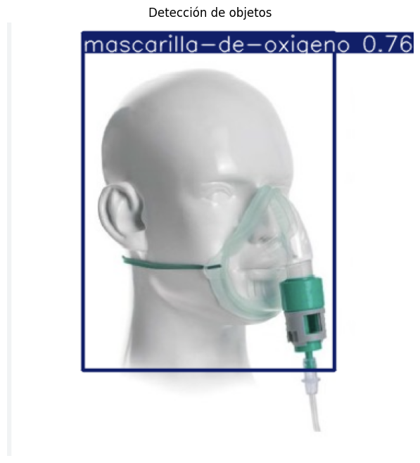
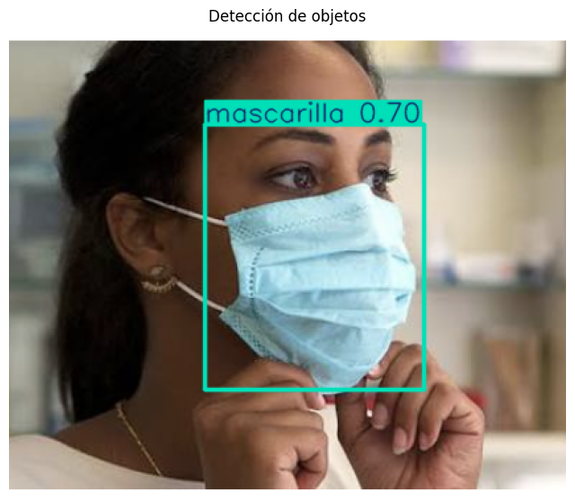
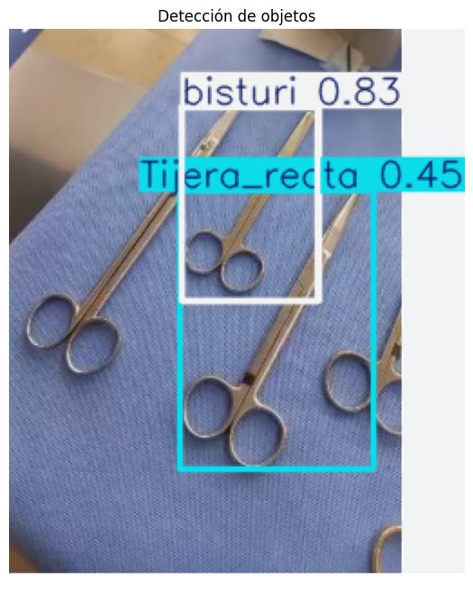

# Detección de Insumos e Instrumentos Médicos con YOLO26

**Entrega Final (Avance 4)** · Taller de Introducción a Visión por Computadora
Facultad de Ciencias Empresariales (IECI–ICINF) · Universidad del Bío‑Bío, Campus Concepción

**Autores:** Fabián Cartes · Diego Codina · Rodrigo Ortega

---

## 1. Descripción del proyecto

Este proyecto entrena y evalúa un **detector de objetos** capaz de reconocer insumos e
instrumentos médicos en fotografías reales. La motivación es práctica: revisar bandejas de
instrumental a mano toma tiempo y produce errores, mientras que un detector permite **contar y
verificar insumos automáticamente desde una cámara**.

El modelo se construye con **YOLO26n** (versión *nano*, ~2,6 M de parámetros) mediante *transfer
learning* sobre un dataset anotado en Roboflow, y realiza la inferencia con la librería
**Ultralytics** apoyándose en **OpenCV** para el dibujo y guardado de resultados.

### Clases detectadas (5)

| Clase | Descripción |
|-------|-------------|
| `Jeringa` | Jeringas |
| `Tijera_recta` | Tijeras rectas de disección |
| `bisturi` | Bisturíes / mangos de bisturí |
| `mascarilla` | Mascarillas quirúrgicas |
| `mascarilla-de-oxigeno` | Mascarillas de oxígeno |

> En el Avance 3 el modelo trabajaba con **4 clases**. En esta entrega final se incorporó la clase
> **`mascarilla-de-oxigeno`**, ampliando el alcance del detector a 5 clases.

---

## 2. ¿Qué hay de nuevo respecto al Avance 3?

En el Avance 3 detectamos que la principal limitación **no era la arquitectura, sino el dataset**:
split no estratificado, desbalance de clases (la clase `mascarilla` casi no aparecía en
entrenamiento) y ausencia de imágenes de fondo. Para esta entrega aplicamos las mejoras propuestas:

- ✅ **Dataset re‑balanceado y re‑particionado** (nuevo export en formato YOLO26).
- ✅ **Se bajó `lr0` de 0.01 a 0.001** para el optimizador AdamW (era la señal de alerta del Avance 3).
- ✅ **Data augmentation dirigida al desbalance:** `mixup=0.1` y `copy_paste=0.1` para "pegar"
  instancias de las clases raras.
- ✅ **Semilla fija** (`seed=42`) para reproducibilidad y `patience=20` (early stopping).
- ✅ **Nueva clase** `mascarilla-de-oxigeno`.

### Experimento descartado — clase `parche curita`

Durante la experimentación probamos añadir una clase de **parche curita** reincorporando un dataset
externo. Los resultados fueron malos y poco fiables: ese dataset mezclaba parches de distintos
tamaños y colores sin un estándar, y el etiquetado/validación eran de baja calidad, arrastrando las
métricas hacia abajo. **Conclusión:** la clase se retiró para no contaminar el rendimiento general
del modelo.

### Impacto de las mejoras (validación)

| Métrica | Avance 3 (4 clases) | **Avance 4 (5 clases)** |
|---------|:-------------------:|:-----------------------:|
| Precisión | 0.773 | **0.964** |
| Recall | 0.774 | **0.911** |
| mAP@50 | 0.829 | **0.967** |
| mAP@50‑95 | 0.563 | **0.737** |

El salto en todas las métricas confirma que el cuello de botella del Avance 3 era efectivamente la
calidad y el balance del dataset.

---

## 3. Estructura del repositorio

```
computer-vision-workshop-submission/
├── avance4.ipynb                 # Notebook principal (entrenamiento + inferencia)
├── README.md
├── Avance3.pdf                   # Presentación del Avance 3
├── assets/
│   ├── metricas/                 # Curvas y gráficos de entrenamiento/validación
│   │   ├── resumen_yolo.png
│   │   ├── matriz_confusion.png
│   │   ├── box_pr_curve.png
│   │   ├── box_f1_curve.png
│   │   └── diagnostico_overfitting.png
│   └── inferencias/              # Resultados de inferencia sobre imágenes nuevas
│       ├── jeringa.png
│       ├── mascarilla_oxigeno.png
│       ├── mascarilla2.png
│       ├── tijera_recta.png
│       ├── bisturi.png ...
```

---

## 4. Librerías necesarias

El proyecto está pensado para ejecutarse en **Google Colab con GPU (Tesla T4)** usando
**Python 3.12**. Las dependencias principales son:

| Librería | Uso |
|----------|-----|
| **ultralytics** (8.4.x) | Carga del modelo YOLO26, entrenamiento e inferencia |
| **opencv-python** (`cv2`) | Conversión de color (BGR↔RGB) y guardado de las imágenes con detecciones |
| **torch / torchvision** | Backend de deep learning (CUDA) |
| **numpy** | Manejo de arreglos |
| **matplotlib** | Visualización de imágenes y curvas de métricas |
| **pandas** | Lectura de `results.csv` y tablas de métricas |
| **gdown** | Descarga del dataset desde Google Drive |

### Instalación

```bash
pip install ultralytics
```

> Instalar `ultralytics` arrastra automáticamente `opencv-python`, `torch`, `numpy`, `matplotlib` y
> `pillow`. En Colab, `pandas` y `gdown` ya vienen preinstalados.

---

## 5. Cómo ejecutar

1. Abre [`avance4.ipynb`](avance4.ipynb) en **Google Colab** y selecciona un entorno con **GPU**.
2. Ejecuta las celdas en orden:
   - **Instalación** de Ultralytics y **descarga** del dataset (`gdown`).
   - **Entrenamiento** del modelo YOLO26n (100 épocas, `imgsz=640`, `batch=16`, AdamW `lr0=0.001`).
   - **Validación** (`model.val()`) y generación de curvas/matriz de confusión.
   - **Inferencia** sobre las imágenes externas de prueba.
3. El mejor modelo se guarda en `runs/detect/train/weights/best.pt` y cada resultado de inferencia
   se exporta con `cv.imwrite(...)`.

---

## 6. Pipeline de inferencia (Ultralytics + OpenCV)

El flujo de inferencia carga el modelo entrenado y dibuja las detecciones sobre cada imagen:

```python
from ultralytics import YOLO
import cv2 as cv
import matplotlib.pyplot as plt

# 1) Cargar el modelo entrenado en el Avance 3/4
model = YOLO('/content/runs/detect/train/weights/best.pt')

# 2) Ejecutar la detección sobre una imagen nueva
results = model('IMAGENES_EXTERNAS/jeringa.png')

for r in results:
    # 3) Leer cajas, confianza y clase
    for box in r.boxes:
        print(f"BBox: {box.xyxy}, Conf: {box.conf}, Clase: {model.names[int(box.cls)]}")

    # 4) Dibujar cajas + etiquetas + confianza
    im_array = r.plot()                       # imagen BGR con anotaciones

    # 5) OpenCV: conversión de color y guardado del resultado
    im_rgb = cv.cvtColor(im_array, cv.COLOR_BGR2RGB)
    cv.imwrite('resultado_imagen.jpg', im_array)

    plt.imshow(im_rgb); plt.axis('off'); plt.show()
```

**OpenCV** se emplea para la conversión de espacio de color (`cv.cvtColor`, BGR→RGB) y para
persistir las imágenes anotadas en disco (`cv.imwrite`), mientras que Ultralytics entrega las cajas
delimitadoras, etiquetas y puntuaciones de confianza.

---

## 7. Resultados de entrenamiento y validación

### Métricas por clase (validación · 129 imágenes, 264 instancias)

| Clase | Precisión | Recall | mAP@50 | mAP@50‑95 |
|-------|:---------:|:------:|:------:|:---------:|
| **Todas** | **0.964** | **0.911** | **0.967** | **0.737** |
| Jeringa | 0.949 | 0.981 | 0.993 | 0.618 |
| Tijera_recta | 1.000 | 0.898 | 0.986 | 0.839 |
| bisturi | 0.965 | 0.893 | 0.947 | 0.848 |
| mascarilla | 0.904 | 0.861 | 0.920 | 0.583 |
| mascarilla-de-oxigeno | 1.000 | 0.923 | 0.990 | 0.797 |

### Resumen del entrenamiento


### Matriz de confusión


### Curva Precisión–Recall &nbsp;·&nbsp; Curva F1



### Diagnóstico de overfitting (train vs. validación)


Las pérdidas de validación descienden junto a las de entrenamiento, **sin señales claras de
sobreajuste** en las curvas de loss.

---

## 8. Evaluación con datos nuevos (imágenes externas)

Para medir la **robustez real** del modelo se probó con **9 imágenes nuevas descargadas de internet**,
que **no pertenecen al dataset original** e incluyen escenarios desafiantes: fondos variados, objetos
con reflejos, un bisturí sobre fondo negro y mascarillas puestas sobre el rostro.

### Ejemplos de inferencia realizada

| Detección correcta (jeringa · 0.89) | Mascarilla de oxígeno (0.76) |
|:---:|:---:|
|  |  |

| Mascarilla (0.70) | Tijera con falsos positivos de bisturí |
|:---:|:---:|
|  |  |

### Tabla de resultados sobre las imágenes nuevas

| Imagen | Objeto esperado | Detección del modelo | Confianza | Resultado |
|--------|-----------------|----------------------|:---------:|-----------|
| `jeringa` | Jeringa | Jeringa | 0.89 | ✅ Acierto (alta confianza) |
| `mascarilla_oxigeno` | Mascarilla de oxígeno | mascarilla-de-oxigeno | 0.76 | ✅ Acierto |
| `mascarilla2` | Mascarilla | mascarilla | 0.70 | ✅ Acierto |
| `mascarilla` | Mascarilla | mascarilla | 0.30 | ⚠️ Acierto (confianza baja) |
| `bisturi_fondo_negro` | Bisturí | bisturi | 0.33 | ⚠️ Acierto (confianza baja) |
| `tijera_recta` | Tijera recta | Tijera_recta **+ 2 bisturí (FP)** | 0.45 | ❌ Acierto con **falsos positivos** |
| `bisturi` | Bisturí | *(sin detección)* | — | ❌ Falso negativo |
| `bisturi2` | Bisturí | *(sin detección)* | — | ❌ Falso negativo |
| `bisturi3` | Bisturí | *(sin detección)* | — | ❌ Falso negativo |

### Análisis crítico de las predicciones

**Aciertos.**
- La **jeringa** es la detección más sólida (conf. 0.89), coherente con su alto mAP@50 (0.993).
- Ambos tipos de **mascarilla** (quirúrgica y de oxígeno) se detectan correctamente incluso puestas
  sobre el rostro, lo que valida la mejora del dataset respecto al Avance 3, donde `mascarilla` era
  la clase más débil.

**Fallos y limitaciones.**
- **El bisturí no generaliza a imágenes nuevas.** Pese a tener excelentes métricas de validación
  (mAP@50 = 0.947), **3 de 4 imágenes externas de bisturí no arrojaron ninguna detección**, y la
  única que se detectó lo hizo con confianza muy baja (0.33). Esto sugiere un **sobreajuste al estilo
  visual del dataset** (fondos, iluminación y encuadres específicos): el modelo aprendió a reconocer
  "los bisturíes del dataset", no bisturíes en general.
- **Persiste la confusión tijera ↔ bisturí:** en la imagen de la tijera aparecen **dos falsos
  positivos** de bisturí (conf. 0.83 y 0.34). Es la misma confusión detectada en la matriz del
  Avance 3, ya que ambos instrumentos comparten forma alargada y metálica.
- Algunas detecciones correctas tienen **confianza baja (0.30–0.33)**, cerca del umbral operativo.

**Conclusión de la evaluación.**
El modelo es **viable y robusto para jeringas y mascarillas**, pero **frágil para bisturíes** fuera
de su distribución de entrenamiento. Las mejoras futuras deberían enfocarse en **diversificar las
imágenes de bisturí** (más fondos, ángulos e iluminaciones), **añadir imágenes de fondo/negativas**
para reducir falsos positivos, y **ajustar el umbral de confianza** (≈0.4) según el caso de uso.

---

## 9. Conclusiones

- Las mejoras de dataset propuestas en el Avance 3 elevaron el **mAP@50 de 0.829 a 0.967** en
  validación, confirmando que la limitación era el dato y no la arquitectura.
- La evaluación con **imágenes externas** revela una brecha entre las métricas de validación y el
  desempeño en el mundo real, especialmente para la clase **bisturí**.
- El **pipeline de inferencia** (Ultralytics + OpenCV) funciona correctamente: carga el modelo
  entrenado, dibuja cajas, etiquetas y confianza, y persiste los resultados.

---

*Universidad del Bío‑Bío · Taller de Introducción a Visión por Computadora · 2026*
